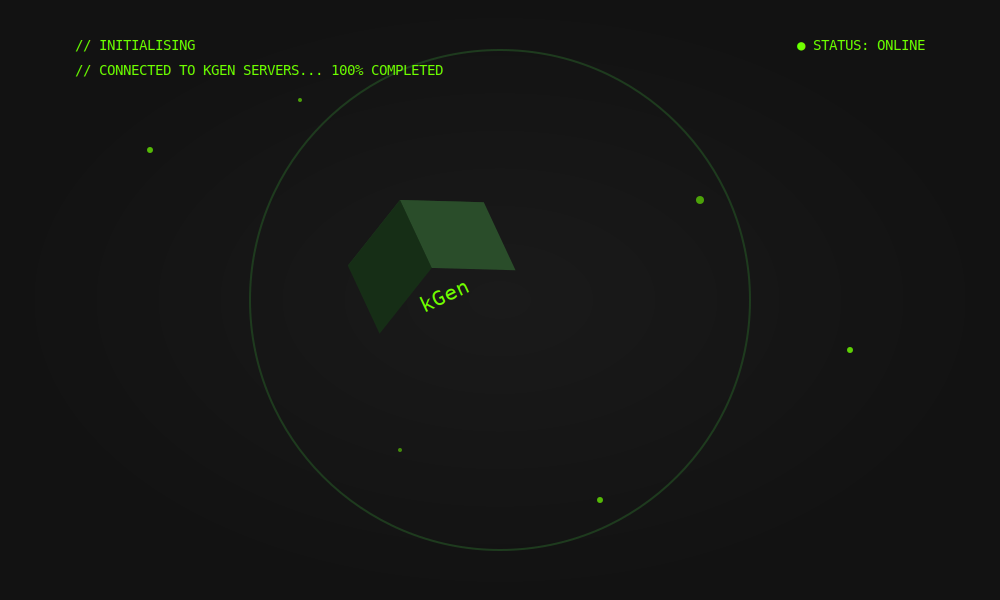

# 🚀 NbAIl – Your Multimodal AI Assistant
> An intelligent, voice-first AI assistant with chat, vision, AR, and productivity control features.

---

## 🎯 Objective

NbAIl is designed to be a futuristic multimodal AI assistant that helps users interact with technology more naturally — using **voice**, **text**, **vision**, and **AR**.

Our goal is to make AI more accessible, immersive, and helpful in real-world scenarios like productivity, education, and curiosity. NbAIl not only answers questions but also sees and understands the world, with features like **voice commands**, **AR overlays**, and **screen tracking**.

---

## 🧠 Team & Approach

### Team Name:
**NbAIl**

### Team Members:
- Nabil Thange – Developer (GitHub -> https://github.com/NabilThange | LinkedIn -> www.linkedin.com/in/nabil-thange)

### Our Approach:
- We imagined what AI would look like if built from a combination of ChatGPT, Google Lens, and J.A.R.V.I.S.
- We integrated Groq for high-speed LLM responses, voice input/output, and used Screenpipe:Terminator for productivity awareness.
- AR Mode was built to feel like a sci-fi assistant — where the user simply points, speaks, and hears the answer.
- We focused on real user experience and a polished UI with meaningful micro-interactions.

---

## 🛠️ Tech Stack

### Core Technologies Used:
- **Frontend**: Next.js, Tailwind CSS
- **3D/Visuals**: Spline (for models and overlay animations)
- **Voice Input & Output**: Groq Whisper (STT), Groq PlayAI (TTS)
- **Backend**: Node.js (Groq integration)
- **Productivity Insights**: Screenpipe
- **Deployment**: Vercel

---

## ✨ Key Features

- ✅ AI Chat Assistant (like ChatGPT, powered by Groq)
- ✅ Extremely Fast Voice-to-text input + Voice responses (no typing needed)
- ✅ AR-Mode: Scan real-world objects and ask questions via Voice. No need to Capture Image and Upload It
- ✅ Personal dashboard, recent chats, chat pinning/renaming
- ✅ Beautiful and fast UI/UX with micro animations and mobile support

---

## 📽️ Demo & Deliverables

- **Demo Video**: [🔗 Paste your demo video link here]
- **Pitch Deck**: [🔗 Paste Google Slides / PPT here]

---

## 🧪 How to Run the Project

### Requirements:
- Node.js
- Groq API Key
- .env file containing:
```
NEXT_PUBLIC_GROQ_API_KEY=your_groq_api_key_here
NEXT_PUBLIC_SUPABASE_URL=your_supabase_url
NEXT_PUBLIC_SUPABASE_ANON_KEY=your_supabase_anon_key
SUPABASE_URL=your_supabase_url
SUPABASE_SERVICE_ROLE_KEY=your_supabase_service_role_key
```

### Installation Steps:
1. Clone the repository:
```bash
git clone https://github.com/NabilThange/NbAIl-Kgen-.git
cd NbAIl-best-
```

2. Install dependencies:
```bash
npm install
# or
pnpm install
#or
npm install --legacy-peer-deps
```

3. Create a `.env.local` file in the root directory with the required environment variables.

4. Start the development server:
```bash
npm run dev
# or
pnpm dev
```

5. Open [http://localhost:3000](http://localhost:3000) in your browser to see the application.

---

## 🧬 Future Scope

- 🌐 **Multi-language support** for voice and text to make the assistant globally accessible  
- 🤖 **More human-like voice tone in TTS** to make conversations feel more natural  
- 📷 **Real-time object tracking in AR** without needing manual image capture  
- 📊 **Export Terminator productivity insights and reports** to help users track app usage, browsing patterns, and focus time across days or weeks  
- 🧩 **Develop a Terminator browser extension** that enables real-time monitoring and voice-based commands — offering context-aware AI suggestions while browsing, working, or multitasking  


---

## 📎 Resources / Credits

- **Groq** – Used for LLM generation, Whisper STT, and PlayAI TTS  
- **Screenpipe** – Provided screentime analytics, clipboard monitoring, and productivity insights  
- **Spline** – For 3D background animations and overlay visuals in AR Mode  
- **Tailwind CSS** – For building clean, responsive, and interactive UI  
- **Next.js** – As the core React framework powering the web application  

---

## 🏁 Final Words

Building **NbAIl** has been a futuristic and immersive journey. We combined the power of **voice**, **vision**, and **augmented reality** to bring users closer to AI that can see, hear, and respond like a real assistant.

This wasn't just about answering questions — it was about creating a natural, beautiful, and sci-fi-like interaction model between humans and machines. From responsive UI to voice-based object scanning, NbAIl was built with user experience and innovation at its core.

A huge thanks to the organizers, the mentors, and the incredible technologies like **Groq** and **Screenpipe** that made this possible. 🚀

---

